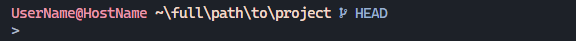

# Oh-My-Posh Themes

Themes I made for personal use. Go well with the dark variants of [Github Theme](https://marketplace.visualstudio.com/items?itemName=GitHub.github-vscode-theme).

Use with [Cascadia Code **NF**](https://github.com/microsoft/cascadia-code) or any [**Nerd Font**](https://www.nerdfonts.com/font-downloads) of your choice.

## Themes

### laminar.omp.json

### hotncold.omp.json

